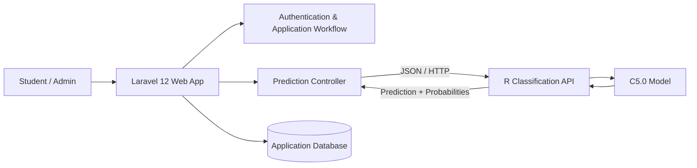
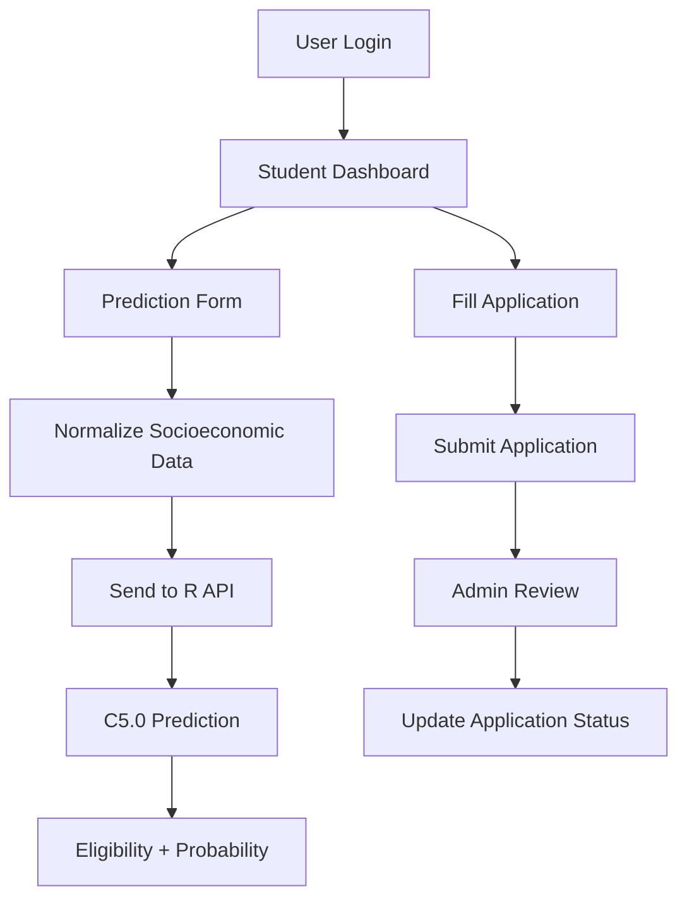

<div align="center">

# 🎓 UKT Reduction Classification

### Decision-support system for tuition reduction applications using Laravel and C5.0 classification

[](https://laravel.com/)
[](https://www.php.net/)
[](https://www.r-project.org/)
[](#system-architecture)

</div>

---

## Overview

This project is a web-based decision-support system for **UKT (Uang Kuliah Tunggal) reduction applications**.

The application combines a Laravel 12 web interface with an external classification service built in R. Student socioeconomic data is sent to the prediction API, where a C5.0 model classifies the submission and returns both the predicted class and probability values.

The system also provides authenticated student submission workflows and an administrative dashboard for reviewing application data and managing application status.

## Key Features

### Student / User

- Authentication and profile management
- Submit UKT reduction applications
- View application details and history
- Track application status
- Access prediction form
- Display classification result and confidence probabilities

### Administrator

- Protected admin dashboard
- View incoming UKT applications
- View application detail
- Update application status
- View historical applications
- View application statistics / charts

### Classification

Input features used by the prediction workflow include:

- parent / household income
- number of dependents
- parent occupation
- child status
- housing status
- DTKS status
- SKTM status

The Laravel application sends normalized input data to the R prediction service and maps the returned class into **eligible / not eligible** results.

## System Architecture



## Related Classification API

The classification service is maintained separately:

**[C5.0 UKT Classification API →](https://github.com/bayupra7ama/klasifikasi-pengurangan-menggunanakan-model-C50-ukt-api)**

For local development, the Laravel application currently expects the prediction service at:

```text
http://127.0.0.1:5000/predict
```

## Tech Stack

| Area | Technology |
| --- | --- |
| Web Framework | Laravel 12 |
| Language | PHP 8.2+ |
| Authentication | Laravel Breeze |
| UI | Blade + Vite |
| Database | Laravel-supported relational database |
| HTTP Integration | Laravel HTTP Client |
| Classification Service | R REST API |
| Machine Learning | C5.0 classification |
| Testing | PHPUnit |

## Main Project Structure

```text
app/
├── Http/
│   ├── Controllers/
│   │   ├── PredictController.php
│   │   ├── PengajuanController.php
│   │   ├── DashboardController.php
│   │   └── UserDashboardController.php
│   └── Middleware/
│       └── IsAdmin.php
├── Models/
│   ├── Pengajuan.php
│   ├── PengajuanKeringanan.php
│   └── User.php

resources/views/
├── admin/
├── pengajuan/
├── user/
├── dashboard/
└── prediksi.blade.php

routes/
└── web.php
```

## Application Flow



## Installation

### Requirements

- PHP 8.2+
- Composer
- Node.js & npm
- Database supported by Laravel
- Running R classification API

### 1. Clone

```bash
git clone https://github.com/bayupra7ama/klasifikasi-pengurangan-ukt.git
cd klasifikasi-pengurangan-ukt
```

### 2. Install dependencies

```bash
composer install
npm install
```

### 3. Environment

```bash
cp .env.example .env
php artisan key:generate
```

Configure your database connection in `.env`.

### 4. Prepare database

```bash
php artisan migrate
php artisan db:seed
```

### 5. Start the classification API

Clone and run the companion R API before using prediction functionality:

```text
https://github.com/bayupra7ama/klasifikasi-pengurangan-menggunanakan-model-C50-ukt-api
```

Ensure the prediction endpoint is reachable by the Laravel application.

### 6. Run Laravel

```bash
composer run dev
```

Or:

```bash
php artisan serve
npm run dev
```

## Important Note

The prediction result is designed as **decision-support output**. Final administrative decisions should still follow the applicable institution's policies, verification process, and supporting documents.

---

<div align="center">

Built to connect web application workflows with practical machine-learning classification.

</div>
